## Preliminaries

This tutorial uses the Python version of Histogrammar. See the [installation guide](../../install) for installing version 0.7 or later.

It also uses the [CMS public dataset](../python-cmsdata). Set up an iterator named `events` in your console. You will need a network connection. If your `events` iterator ever runs out, refresh it with

```python
events = EventIterator()
```

## First histogram

Simple things first: you have some data in Python (`events`) and you want to see how they're distributed. How do you do that in Histogrammar?

Like this:

```python
from histogrammar import *

histogram = Bin(100, 0, 100, lambda event: event.met.pt)

for i, event in enumerate(events):
    if i == 1000: break
    histogram.fill(event)

roothist = histogram.root("name", "title")
roothist.Draw()
```

The output should be something like


### What just happened?

The first line,

```python
from histogrammar import *
```

imports the basic functions and classes you need to define plots. The next gets to the heart of what Histogrammar is all about. It defines an empty histogram:

```python
histogram = Bin(100, 0, 100, lambda event: event.met.pt)
```

As a ROOT user, you are no doubt familiar with the concept of a histogram as an empty container that must be filled to be meaningful. However, the fill rule `lambda event: event.met.pt` may be unexpected.

In a ROOT typical script, you would declare ("book") a suite of empty histograms in an initialization stage and then fill them in a loop over a zillion events. The physics-specific logic of what to put in each histogram can end up being far from the booking code.

In Histogrammar, the rule for how to fill the histogram is provided in the constructor, so that the loop can be automated with no input from the data analyst. Although this is useful in itself for maintainability (it's easier to spot incongruities between the binning and the fill rule when they're right next to each other), it is also important for frameworks like Apache PySpark that distribute the fill operation. Without consolidating the fill logic like this, a PySpark `aggregate` call would be very difficult to maintain.

Finally, the last line

```python
roothist = histogram.root("name", "title")
```

creates a ROOT object from the Histogrammar object. In this case, it is a `ROOT.TH1D`, but the exact choice depends on what kind of Histogrammar object you're converting.

You can style and manipulate this ROOT object as you ordinarily would, using ROOT functions. The intention of Histogrammar is not to replace ROOT or any other plotting framework, but to provide an alternate means of aggregation that cuts across frameworks and encourages sharing of data, using each tool for what it does best.

## Composability

In the above, it might seem that `Bin` is Histogrammar's word for "histogram," but it is more general than that. The `Bin` constructor has several arguments with default values:

  * `value`: how to fill a bin between the low and high edges;
  * `underflow`: what to do with data below the low edge;
  * `overflow`: what to do with data above the high edge;
  * `nanflow`: what to do with data that is not a number (`NaN`).

ROOT would fill the value of each bin, as well as the underflow and overflow, with a count of entries. (Histogrammar additionally has a "nanflow" so that every input value fills _some_ bin.) This is the most common case, so Histogrammar has `Count()` as default values for these arguments.

Here, the similarity ends. Histogrammar's `Count` is an aggregator of the same sort as `Bin`, and they can be used interchangeably. You could have counted the data instead of binning it:

```python
count = Count()

for i, event in enumerate(events):
    if i == 1000: break
    count.fill(event)

print(count)
```

produces `<Count 1000.0>`, though this is only useful if you didn't already know how many elements you were looping over.

Let's try something more interesting: put a `Bin` of `Count` inside of a `Bin`.

```python
hist2d = Bin(10, -100, 100, lambda event: event.met.px,
             value = Bin(10, -100, 100, lambda event: event.met.py))

for i, event in enumerate(events):
    if i == 1000: break
    hist2d.fill(event)

roothist = hist2d.root("name2", "title")
roothist.Draw("colz")
```


A `Bin` of `Bin` of `Count` is a two dimensional histogram because the thing that we put inside each bin of the first histogram is another whole histogram. With just two primitives, we can express histograms of any dimension.

It's hard to visualize histograms with more than two dimensions, but we can still aggregate them. This kind of data reduction can be useful for things other than plotting. ROOT can view histograms up to three dimensions, so we can try it:

```python
hist3d = Bin(10, -100, 100, lambda muon: muon.px,
             Bin(10, -100, 100, lambda muon: muon.py,
                 Bin(10, -100, 100, lambda muon: muon.pz)))

for i, event in enumerate(events):
    if i == 1000: break
    for muon in event.muons:
        hist3d.fill(muon)

roothist = hist3d.root("name3", "title")
```

In Histogrammar version 0.7, at least, this raises

```
Traceback (most recent call last):
  File "<stdin>", line 1, in <module>
AttributeError: 'Bin' object has no attribute 'root'
```

meaning that Histogrammar does not have a known conversion from `Bin` of `Bin` of `Bin` of `Count` to a corresponding ROOT object. The types of histograms you can build with Histogrammar is literally infinite, but there is a finite set of patterns mapping Histogrammar objects onto objects in a given plotting library. The Histogrammar-ROOT front-end may someday handle three-dimensional histograms, but as of version 0.7 it does not.

Nevertheless, the aggregated data is available inside `hist3d`. Explore it with Python's `dir()` or tab-completion and come up with creative ways to visualize it.

```python
import ROOT
for i, x in enumerate(hist3d.values):
    low, high = hist3d.range(i)
    roothist = x.root("slice {}".format(i), "{} <= px < {}".format(low, high))
    roothist.Draw("colz")
    ROOT.gPad.SaveAs("slice_{}.png".format(i))

import os
os.system("convert -delay 100 -loop 0 slice*.png hist3d.gif")
```


This could be improved with better binning, better ROOT styling (such as a fixed `colz` scale), and animated GIF conversion (pause before repeating), but you get the idea.

## Visual tour of Histogrammar primitives

We managed to produce three different visualizations with only `Count` and `Bin`, but there are two dozen different kinds of primitives to work with. Let's try a few more.

`Average` is a drop-in replacement for `Count` that averages a quantity instead of counting entries.

```python
average = Average(lambda event: event.met.pt)

for i, event in enumerate(events):
    if i == 1000: break
    average.fill(event)

print(average)
```

prints `<Average mean=26.5509706109>`.

If we bin it, we approximate a two-dimensional distribution as a function.


```python
pt_vs_vertices = Bin(20, 0.5, 20.5, lambda event: event.numPrimaryVertices,
                     Average(lambda event: event.met.pt))

events = EventIterator()
for i, event in enumerate(events):
    if i == 10000: break
    pt_vs_vertices.fill(event)

roothist = pt_vs_vertices.root("name4")
roothist.GetXaxis().SetTitle("number of primary vertices")
roothist.GetYaxis().SetTitle("average MET pT")
roothist.Draw()
```


This is a profile plot (`roothist` is literally a `ROOT.TProfile`), which should be familiar to ROOT users. Profile plots usually have error bars, but the required information to make the error bar (variance in each bin) is not available because we only accumulated the averages.

A primitive called `Deviate` accumulates mean and variance:

```python
deviate = Deviate(lambda event: event.met.pt)

for i, event in enumerate(events):
    if i == 1000: break
    deviate.fill(event)

print(deviate)
```

prints `<Deviate mean=24.5114851815 variance=279.49272031>`. (Why the weird name? Every primitive in Histogrammar is a verb, and "variance" and "standard deviation" are nouns. Type-safe versions of Histogrammar&mdash; which does not include Python&mdash; use verb tenses to specify which stage of development the primitive is in. Python just uses duck typing.)

All we have to do to get error bars is to swap `Average` for `Deviate`.

```python
pt_vs_vertices = Bin(20, 0.5, 20.5, lambda event: event.numPrimaryVertices,
                     Deviate(lambda event: event.met.pt))

events = EventIterator()
for i, event in enumerate(events):
    if i == 10000: break
    pt_vs_vertices.fill(event)

roothist = pt_vs_vertices.root("name5")
roothist.GetXaxis().SetTitle("number of primary vertices")
roothist.GetYaxis().SetTitle("average MET pT")
roothist.Draw()
```


It may be useful to know that every primitive has an `entries` (number of entries) field, and `Count` is nothing but a number of entries. Therefore, anything based on `Bin` can be turned into a simple histogram _without re-filling_.

```python
roothist2 = pt_vs_vertices.histogram().root("name6")
roothist2.Draw()
```

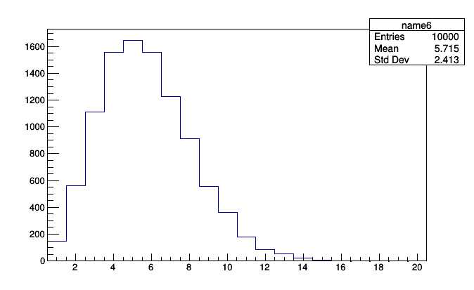

This can help you answer questions about your plots using data that you already have on-hand.

### Alternate binning methods

`Count`, `Average`, and `Deviate` differ from `Bin` in one important aspect: they aggregate data, but do not pass it on to a sub-aggregator. If you compose aggregators into a tree, `Count`, `Average`, and `Deviate` will always be leaves and `Bin` will always be an internal node. This distinction is made in [the specification](../../specification) as primitives of "the first kind," "the second kind," etc. (The allusion to alien encounters is intentional.)

Peruse the specification to see what other "first kind" primitives you can make and think about how you'd be able to use things like quantiles and min/max per bin in an analysis. In this tutorial, we move on to alternate binning methods.

Standard binning slices a numeric interval into equal-length subintervals. The aggregator must do something with values that fall below (underflow) or above (overflow) the interval, and the data analyst has to guess an appropriate interval. It's not uncommon to make a histogram of, say, momentum, only to discover that the tail reaches higher than you expected (cutting it off) or lower than you expected (compressing the meaningful information into one or two bins). You then have to re-fill the histogram, which is aggregating when it happens frequently or takes a long time to fill.

If we replace the "dense vector" of a standard histogram with a "sparse vector," in which only non-zero values are filled, then there is no need to specify a minimum and maximum bin before filling. Consider the following:

```python
histogram = SparselyBin(1.0, lambda event: event.met.pt)

events = EventIterator()
for i, event in enumerate(events):
    if i == 1000: break
    histogram.fill(event)

roothist = histogram.root("name7", "title")
roothist.Draw()
```

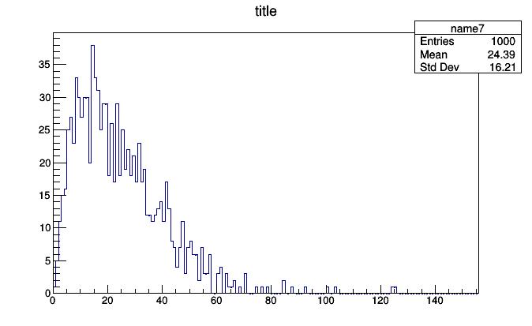

This histogram was created with no prior knowledge that the minimum `event.met.pt` would be `0` and the maximum would be `93`. Only the bin width (the first argument, `1.0` momentum units per bin) had to be specified.

To see how this histogram differs, print the bins:

```python
print(histogram.bins)
```
```
{1: <Count 4.0>, 2: <Count 5.0>, 3: <Count 10.0>, 4: <Count 23.0>, 5: <Count 17.0>, 6: <Count 21.0>, 7: <Count 21.0>, 8: <Count 17.0>, 9: <Count 34.0>, 10: <Count 26.0>, 11: <Count 22.0>, 12: <Count 24.0>, 13: <Count 32.0>, 14: <Count 25.0>, 15: <Count 26.0>, 16: <Count 22.0>, 17: <Count 29.0>, 18: <Count 23.0>, 19: <Count 27.0>, 20: <Count 25.0>, 21: <Count 22.0>, 22: <Count 24.0>, 23: <Count 24.0>, 24: <Count 19.0>, 25: <Count 23.0>, 26: <Count 17.0>, 27: <Count 17.0>, 28: <Count 20.0>, 29: <Count 24.0>, 30: <Count 18.0>, 31: <Count 9.0>, 32: <Count 13.0>, 33: <Count 25.0>, 34: <Count 17.0>, 35: <Count 19.0>, 36: <Count 18.0>, 37: <Count 17.0>, 38: <Count 15.0>, 39: <Count 9.0>, 40: <Count 16.0>, 41: <Count 17.0>, 42: <Count 19.0>, 43: <Count 15.0>, 44: <Count 17.0>, 45: <Count 16.0>, 46: <Count 8.0>, 47: <Count 9.0>, 48: <Count 8.0>, 49: <Count 5.0>, 50: <Count 9.0>, 51: <Count 4.0>, 52: <Count 10.0>, 53: <Count 9.0>, 54: <Count 2.0>, 55: <Count 3.0>, 56: <Count 4.0>, 57: <Count 7.0>, 58: <Count 1.0>, 59: <Count 2.0>, 60: <Count 3.0>, 61: <Count 5.0>, 62: <Count 2.0>, 64: <Count 1.0>, 65: <Count 4.0>, 66: <Count 3.0>, 67: <Count 1.0>, 68: <Count 4.0>, 69: <Count 1.0>, 70: <Count 1.0>, 72: <Count 1.0>, 73: <Count 1.0>, 74: <Count 1.0>, 75: <Count 2.0>, 76: <Count 1.0>, 77: <Count 1.0>, 78: <Count 1.0>, 79: <Count 1.0>, 82: <Count 1.0>, 92: <Count 1.0>}
```

It's a Python dictionary, mapping non-empty bin indexes to `Count` objects. As new values are encountered, new bins are created, as well as a potentially new minimum and maximum.

```python
print(len(histogram.bins), histogram.low, histogram.high, histogram.minBin, histogram.maxBin)
```
```
(79, 1.0, 93.0, 1, 92)
```

```python
for i, event in enumerate(events):
    if i == 1000: break
    histogram.fill(event)

print(len(histogram.bins), histogram.low, histogram.high, histogram.minBin, histogram.maxBin)
```
```
(86, 0.0, 99.0, 0, 98)
```

Keep in mind that the memory use of a `Bin` is fixed, but a `SparselyBin` can grow without bound, depending on the distribution of the data. In particular, a distribution with a long tail might create a new bin for every tail event. Another concern is in converting a sparse histogram with far-flung values (such as `1e9` to represent "missing data") into a dense histogram: all the intermediate bins would be created with zero value.

These are usually not issues in exploratory data analysis, where sparse histograms are the most useful. Just be sure to check `histogram.minBin` and `histogram.maxBin` before attempting to plot it and replace `SparselyBin` with `Bin` and well-chosen `low` and `high` values in the final analysis.

That said, `SparselyBin` can be composed with any sub-aggregators to make sparse profile plots:

```python
pt_vs_vertices = SparselyBin(1.0, lambda event: event.numPrimaryVertices,
                             Deviate(lambda event: event.met.pt))

events = EventIterator()
for i, event in enumerate(events):
    if i == 10000: break
    pt_vs_vertices.fill(event)

roothist = pt_vs_vertices.root("name8")
roothist.GetXaxis().SetTitle("number of primary vertices")
roothist.GetYaxis().SetTitle("average MET pT")
roothist.Draw()
```

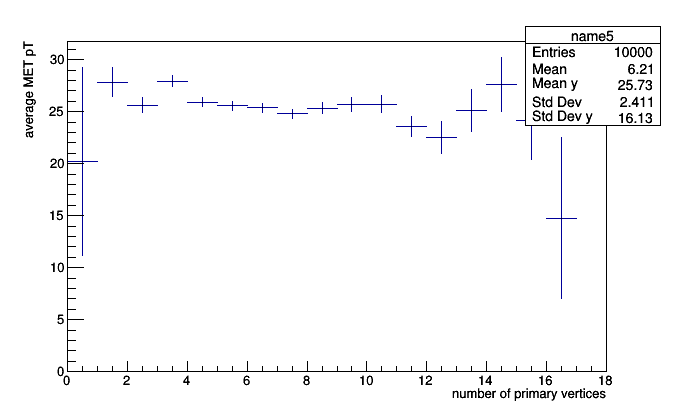

sparse two-dimensional histograms:

```python
hist2d = SparselyBin(5.0, lambda event: event.met.px,
                     SparselyBin(5.0, lambda event: event.met.py))

events = EventIterator()
for i, event in enumerate(events):
    if i == 1000: break
    hist2d.fill(event)

roothist = hist2d.root("name9", "title")
roothist.Draw("colz")
```


and so on.

Notice that this last example has negative indexes (print `hist2d.bins.keys()`) and a `SparselyBin` nested within a `SparselyBin`.

Histogrammar has a few other binning methods:

   * `CentrallyBin`: a fixed set of irregularly spaced bins, defined by _bin centers._ Specifying the irregularly spaced bins by their centers has two nice features: no gaps and no underflow/overflow. It has an analogy with one-dimensional clustering. As of Histogrammar version 0.7, an automated translation to ROOT has not been defined.
   * `AdaptivelyBin`: the ultimate binning method for when you know nothing about the distribution: you specify a maximum number of bins and it adapts irregular bin centers to fit. It uses a one-dimensional clusering algrithm to adjust the bin centers, and the maximum memory use is finite (capped by the maximum number of bins). As of Histogrammar version 0.7, however, an automated translation to ROOT has not been defined.
   * `Partition`: could be used for irregularly spaced bins defined by _bin edges,_ though it was intended for groups of plots with different cuts (such as a series of different pseudorapidity cuts or heavy ion centrality bins).
   * `Categorize`: like `SparselyBin`, but with string-valued categories, rather than numbers. A histogram over a categorical domain is also known as a "bar chart." There's a certain program that excels at these.

Although `SparselyBin` requires more a priori knowledge (the bin width) than `AdaptivelyBin`, the fixed bin width and alignment of bins with round numbers are very useful in an analysis.

All of these are aggregators "of the second kind" in [the specification](../../specification).

### Structures made of histograms

If "first kind" primitives like `Count`, `Average`, and `Deviate` are like stars and binning methods like `Bin`, `SparselyBin`, and `AdaptivelyBin` are like clusters of stars, there are yet larger structures like galaxies and galactic clusters. Some of the things we do in an analysis involve a coordinated use of multiple histograms.

One of the most common is an efficiency plot: the probability of passing a cut as a function of some binned variable. You could make this by filling two histograms, one with the cut, the other without, and then dividing them, but Histogrammar has a built-in primitive:

```python
frac = Fraction(lambda event: event.numPrimaryVertices > 5,
                Bin(30, 0, 100, lambda event: event.met.pt))

events = EventIterator()
for i, event in enumerate(events):
    if i == 10000: break
    frac.fill(event)

roothist = frac.root("name10", "title")
roothist.SetTitle(";MET pT;fraction with number of primary vertices > 5")
roothist.Draw()
```


Note that the ROOT object returned by `frac.root` is a `ROOT.TEfficiency`. This lets you choose different statistics for the error bars, which is not Histogrammar's job, but ROOT's.

There's nothing stopping you from making an efficiency plot from a sparsely binned histogram. Histogrammar ensures that the numerator and denominator have the same binning.

```python
frac = Fraction(lambda event: event.numPrimaryVertices > 5,
                SparselyBin(5.0, lambda event: event.met.pt))

for i, event in enumerate(events):
    if i == 10000: break
    frac.fill(event)

roothist = frac.root("name11", "title")
roothist.SetTitle(";MET pT;fraction with number of primary vertices > 5")
roothist.Draw()
```

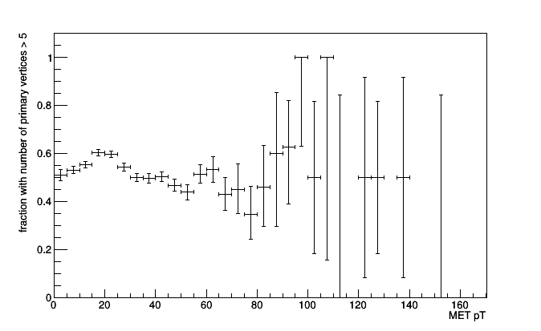

In fact, you could compute the fraction of anything, even a simple count.

```python
frac = Fraction(lambda event: event.numPrimaryVertices > 5, Count())

for i, event in enumerate(events):
    if i == 100: break
    frac.fill(event)

print(frac.numerator.entries / frac.denominator.entries)
```

Another of these superstructures is a suite of stacked or overlaid histograms. The `Stack` and `Partition` primitives can both be thought of as extensions of `Fraction`. Whereas `Fraction` fills two sub-aggregators, one if a selection is satisfied and the other regardless, `Stack` fills _N + 1_ sub-aggregators, each with the events that pass _N_ successively tighter cuts.

```python
stack = Stack([5, 10, 15, 20], lambda event: event.numPrimaryVertices,
              Bin(100, 0, 100, lambda event: event.met.pt))

for i, event in enumerate(events):
    if i == 1000: break
    stack.fill(event)

roothist = stack.root("name12", "name13", "name14", "name15", "name16")
for i, h in enumerate(roothist.values()):
    h.SetFillColor(i + 2)

roothist.Draw()
```

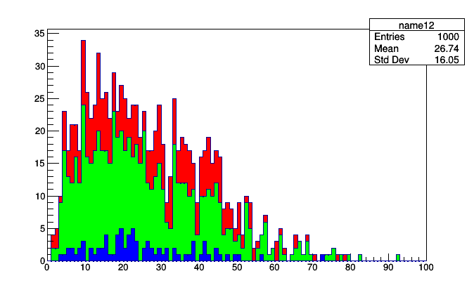

The `stack.root` call has to give names to each of the histograms (consider using Python's `*args` syntax if you want to dynamically generates a list `args`) and it returns a Python `OrderedDict` of `ROOT.TH1D`. They keys of this dictionary are the cut thresholds and you can iterate over the values (as above) to give them styles.

The most common use of stacked histograms in high energy physics doesn't fit the case above: usually, a stack shows data drawn from different sources. This illustrates a limitation in Histogrammar's scope: all aggregators, no matter how complex with nested primitives, are filled with data from _one_ data source. The lambda functions in almost all of the examples above took `event` as their argument. If you want to collect data from multiple sources, you'll have to do multiple aggregation "runs."

Suppose that we have two collections: muons and jets. (In a typical physics analysis, the datasets would all be events, drawn from different Monte Carlo generators.) For simplicity, we'll make two lists from our `events` iterator:

```python
muons = []
for i, event in enumerate(EventIterator()):
    if i == 1000: break
    for muon in event.muons:
        muons.append(muon)

jets = []
for i, event in enumerate(EventIterator()):
    if i == 1000: break
    for jet in event.jets:
        jets.append(jet)
```

And now we'll make two sets of the same kind of histogram. Note that all Histogrammar aggregators have a `copy()` method to recursively copy the tree structure, making an identical but independent object, and a `zero()` method to do the same, but making an empty container, rather than an identical one.

```python
template = Bin(100, -100, 100, lambda particle: particle.px)
muonsPlot = template.copy()
jetsPlot = template.copy()

for muon in muons:
    muonsPlot.fill(muon)

for jet in jets:
    jetsPlot.fill(jet)
```

The `Stack` primitive has a special constructor for taking histograms from different sources: if they're not compatible (different bins), it will raise an exception.

```python
stack = Stack.build(muonsPlot, jetsPlot)

roothist = stack.root("name17", "name18")
for i, h in enumerate(roothist.values()):
    h.SetFillColor(i + 2)

roothist.Draw()
```

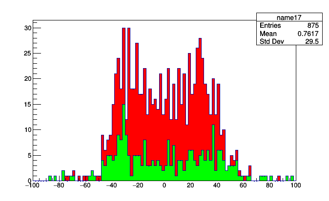

The beauty of this is that you don't have to aggregate them again to stack them in a different order. Just change the order of `Stack.build`.

```python
stack = Stack.build(jetsPlot, muonsPlot)

roothist = stack.root("name19", "name20")
for i, h in enumerate(reversed(roothist.values())):
    h.SetFillColor(i + 2)

roothist.Draw()
```

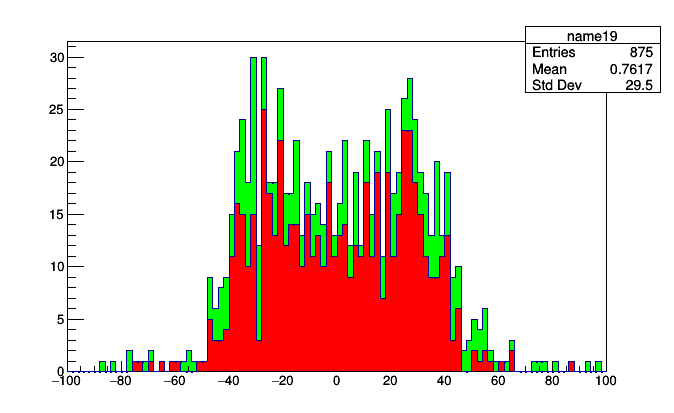

(The first order was better.)

Getting back to the relationship between `Fraction`, `Stack`, and `Partition`, a `Fraction` is just a `Stack` with one cut. That is,

```python
frac = Fraction(lambda event: event.numPrimaryVertices > 5,
                Bin(30, 0, 100, lambda event: event.met.pt))
```

is the same thing as

```python
frac = Stack([5], lambda event: event.numPrimaryVertices,
             Bin(30, 0, 100, lambda event: event.met.pt))

# denominator is frac.values[0]
# numerator is frac.values[1]
```

So what's `Partition`? An event that satisfies a `Stack` threshold fills all sub-aggregators up to and including that one. Each sub-aggregator in the list covers a subinterval of the previous one. As a Venn diagram, the domains the sub-aggregators in a `Stack` cover would look like this:


An event that satisfies a `Partition` threshold fills exactly one sub-aggregator: their domains partition the space with a Venn diagram that looks like this:


After filling, you simply overlay the plots. The `Stack` is guaranteed to not overlap because the first (back) histogram contains all events, the next contains a subset, etc. The plots of a `Partition` may overlap, but each represents a distinct set of events.

Here is a real-world use of `Stack` and `Partition`. You might want to compare the momenta of muons measured by different parts of the detector (these cuts on pseudorapidity (`eta`) correspond to qualitatively different parts of the CMS detector, which is where these data originated).

```python
stack = Stack([0.8, 1.2, 1.7], lambda muon: abs(muon.eta),
              Bin(50, 0, 200, lambda muon: muon.p))

partition = Partition([0.8, 1.2, 1.7], lambda muon: abs(muon.eta),
                      Bin(50, 0, 200, lambda muon: muon.p))

events = EventIterator()
for i, event in enumerate(events):
    if i == 10000: break
    for muon in event.muons:
        stack.fill(muon)
        partition.fill(muon)

rootstack = stack.root("barrel", "overlap", "endcap-2", "endcap-1")
for i, h in enumerate(rootstack.values()):
    h.SetFillColor(i + 2)

rootstack.Draw()
```

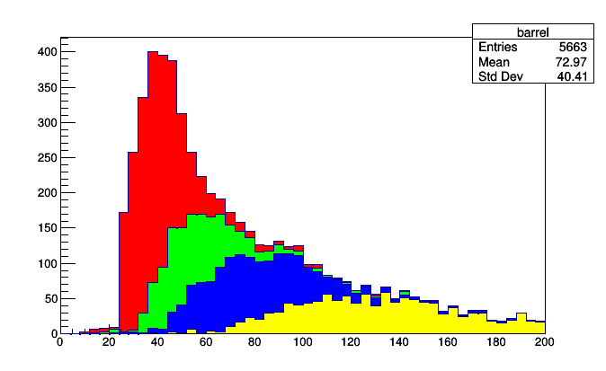

```python
rootpartition = partition.root("barrel", "overlap", "endcap-2", "endcap-1")
for i, h in enumerate(rootpartition.values()):
    h.SetLineColor(i + 2)
    h.SetLineWidth(2)

rootpartition.Draw()
```


A `Partition` could also be used to define a single, irregularly binned histogram by bin edges (as opposed to `CentrallyBin`, which uses bin centers). Just replace the sub-aggregator with `Count()`.

```python
histogram = Partition([-2.4, -1.7, -1.2, -0.8, 0.0, 0.8, 1.2, 1.7, 2.4],
                      lambda muon: muon.eta, Count())

for i, event in enumerate(events):
    if i == 1000: break
    for muon in event.muons:
        histogram.fill(muon)

print(histogram.cuts)
```
```
((-inf, <Count 1.0>), (-2.4, <Count 70.0>), (-1.7, <Count 45.0>), (-1.2, <Count 47.0>), (-0.8, <Count 91.0>), (0.0, <Count 103.0>), (0.8, <Count 43.0>), (1.2, <Count 55.0>), (1.7, <Count 55.0>), (2.4, <Count 1.0>))
```

The first bin, for which `muon.eta` is at least minus infinity, has 1 muon. The next, which starts at &ndash;2.4 (the approximate edge of the detector), has 70 muons, continuing up to the last bin, which starts at 2.4 (the other edge of the detector), which also has 1 spurious muon. The first and last bins may be thought of as underflow and overflow because they extend to negative and positive infinity, or they may be treated as ordinary bins. The same is true of the first and last bins in a `CentrallyBin`.

Although this use of `Partition` is not how it was originally intended, it is perfectly valid and should someday have an automated conversion to irregularly binned ROOT histograms. You should think of these primitives as your building blocks, provided to construct whatever statistic you need, and handle converting it to a visualization later.

## Cuts and other adapters

So far, we haven't mentioned cuts. The advantage of attaching fill rules to the primitives as lambda functions was to separate the analysis-specific code from the loop over data. It would completely miss the point to apply a cut like this:

```python
histogram = Bin(100, 0, 100, lambda event: event.met.pt)

for i, event in enumerate(events):
    if i == 1000: break
    if event.numPrimaryVertices > 5:    # oh no!
        histogram.fill(event)
```

The `event.numPrimaryVertices > 5` is part of your analysis, and it belongs in the histogram definition. ROOT histograms constructed by `TTree.Draw` include selections as part of the constructor, and so can Histogrammar.

In Histogrammar, however, it's another primitve: `Select`. It can take a boolean function or one that returns non-negative numbers as weights (0.0 is equivalent to cutting the event, 1.0 is equivalent to passing it, 0.5 downweights it by half, and 2.0 upweights it).

```python
histogram = Select(lambda event: event.numPrimaryVertices > 5,
                   Bin(100, 0, 100, lambda event: event.met.pt))

for i, event in enumerate(events):
    if i == 1000: break
    histogram.fill(event)

roothist = histogram.root("name22", "title")
roothist.Draw()
```

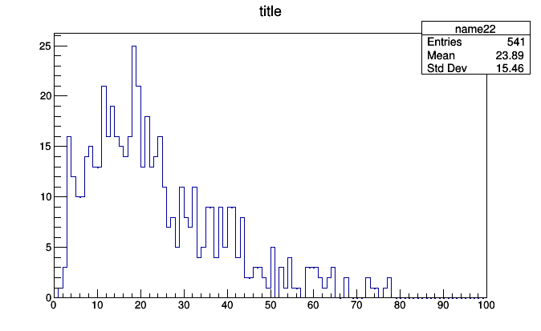

This might seem like a petty distinction because of the simplicity of the examples. This tutorial only covers the plotting front-end, not aggregation back-ends, so all of my examples involve a Python for loop where it's easy to see what the if statement is doing.

But what if you had hundreds of histograms, all with different cuts? If each cut is applied by a `Select` primitive, you can scan over them programmatically and print the cut associated with the histogram. (A future version of Histogrammar will provide this algorithm.) The aggregators become self-documenting in a way that would never be possible with applying cuts in code.

Moreover, what if you're distributing your analysis with PySpark, or accelerating it with Numpy or a JIT or GPU back-end? Then you won't have control over the loop that fills them. (Even the order of operations may be altered for performance.) Then it wouldn't be _possible_ to insert if statements: the analysis must be entirely expressed in the composition of primitives.

### Adapters

The way to think of building an analysis out of primitives is by thinking of each as an "adapter," like the plugs in a VCR or stereo. `Select` is a plug that applies a cut, but does nothing else. `Bin` splits a continuous interval, sending data into one of its sub-aggregators, etc.

Here's another: `Branch` splits the data stream into _N_ copies, sending the data into all of its sub-aggregators. Suppose that we want to compute the minimum, first quartile, median, third quartile, and maximum of each bin in a histogram? We'd do that like this:

```python
metpt = lambda event: event.met.pt

box_and_whiskers =
    Bin(20, 0.5, 20.5, lambda event: event.numPrimaryVertices,
        Branch(Minimize(metpt),
               Quantile(0.25, metpt),
               Quantile(0.5, metpt),
               Quantile(0.75, metpt),
               Maximize(metpt)))
```

Although ROOT does not have a way to draw it (as far as I know), this is known as a [box-and-whikers plot](http://en.wikipedia.org/wiki/Box_plot) and is used in place of a profile plot.

Or maybe you want to make a residuals plot with ordinary least squares and mean absolute errors for comparison:

```python
residuals =
    Bin(100, -10, 10, lambda hit: hit.position,
        Branch(Deviate(lambda hit: hit.residual),
               AbsoluteErr(lambda hit: hit.residual)))
```

You would need to write the code that extracts the data from these containers and plots them in ROOT since you're the only one who knows how you want to visualize them. But if you have already experienced a need for non-standard aggregations, you've been writing this kind of code already. ROOT histograms are manually filled with `SetBinContent`.

## Directories of histograms

Another kind of adapter, with much broader applicability, is the directory of histograms. ROOT has such a concept and uses it to organize histograms in a file on disk.

Histogrammar uses it for a different reason: to bind histograms together so that they can all be filled as one object. I mentioned above that some back-ends restrict access to the fill loop because it might be executed out of order or dispatched to a Spark cluster or GPU. To do this individually with each histogram would be tedious for you, the data analyst and also be slow for the computer.

A typical analysis involves hundreds of individual plots. Bind them together in an `UntypedLabel` primitive:

```python
import math

muonAnalysis = UntypedLabel(
    pt = Bin(100, 0, 100, lambda muon: muon.pt),
    p = Bin(100, 0, 100, lambda muon: muon.p),
    eta = Bin(100, -2.4, 2.4, lambda muon: muon.eta),
    phi = Bin(100, -math.pi, math.pi, lambda muon: muon.phi),
    # imagine this being much longer...
    )

for i, event in enumerate(events):
    if i == 10000: break
    for muon in event.muons:
        muonAnalysis.fill(muon)
```

The filling loop only needs to call `muonAnalysis.fill` to fill all the histograms within it. `UntypedLabel` is a bit like `Branch` (above) except that it provides a name for each sub-aggregator, which can be very useful for bookkeeping.

(Why `UntypedLabel`? There's also a variant named `Label` that can only deal with sub-aggregators of identical type, which is the case for the above example: they're all `Bin` of `Count`. If you want to mix histograms with profile plots, `Label` can't do it, but `UntypedLabel` can. Why, then, does `Label` even exist? For statically typed languages where that's an advantage. Python is not such a language so just use `UntypedLabel` for your Python work.)

To pull one of the histograms out of the `UntypedLabel` and plot it, use `get`.

```python
import ROOT

rootpt = muonAnalysis.get("pt").root("muon pt")
rootp = muonAnalysis.get("p").root("muon p")
rooteta = muonAnalysis.get("eta").root("muon eta")
rootphi = muonAnalysis.get("phi").root("muon phi")

canvas = ROOT.TCanvas()
canvas.Clear()
canvas.Divide(2, 2)

canvas.cd(1); rootpt.Draw()
canvas.cd(2); rootp.Draw()
canvas.cd(3); rooteta.Draw()
canvas.cd(4); rootphi.Draw()
```

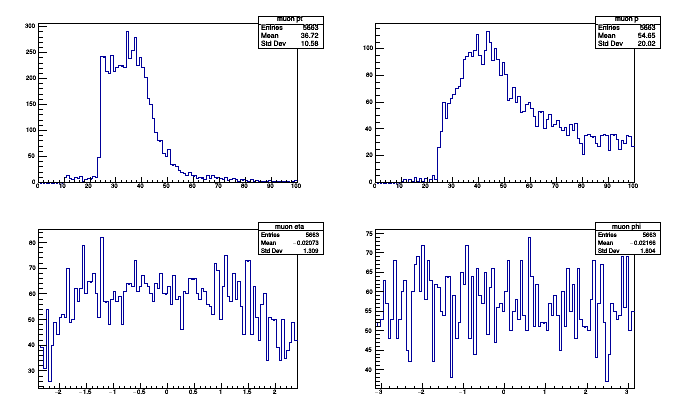

Thanks to composability, `UntypedLabels` can be nested to make subdirectories for better organization.

```python
muonAnalysis = \
    UntypedLabel(
        cartesian = UntypedLabel(
            px = Bin(100, 0, 100, lambda muon: muon.px),
            py = Bin(100, 0, 100, lambda muon: muon.py),
            pz = Bin(100, 0, 100, lambda muon: muon.pz)),
        cylindrical = UntypedLabel(
            pt = Bin(100, 0, 100, lambda muon: muon.pt),
            eta = Bin(100, -2.4, 2.4, lambda muon: muon.eta),
            phi = Bin(100, -math.pi, math.pi, lambda muon: muon.phi)))
```

If the analysis code is starting to look more like a configuration file than a computer program, good. It's supposed to.

In the discussion on Stacked plots, I mentioned that a Histogrammar aggregation tree can only be applied to one data stream. This limitation again becomes relevant here: a physics analysis might involve plots of events (where each entry in a histogram is one event) as well as plots of muons and jets (where each entry in a histogram is one muon or jet), etc. These must be in _different bundles._

For instance, suppose that we want histograms of event-level quantities (MET pt and number of primary vertices), histograms of muon-level quantities (momentum components, charge, and isolation), and histograms of jet-level quantities (momentum components and b-tag). This will require at least three `UntypedLabels`.

```python
eventAnalysis = \
    UntypedLabel(
        metpt = Bin(100, 0, 100, lambda event: event.met.pt),
        numPrimaryVertices = Bin(100, 0, 100, lambda event: event.numPrimaryVertices))

muonAnalysis = \
    UntypedLabel(
        pt = Bin(100, 0, 100, lambda muon: muon.pt),
        eta = Bin(100, -2.4, 2.4, lambda muon: muon.eta),
        phi = Bin(100, -math.pi, math.pi, lambda muon: muon.phi),
        charge = CentrallyBin([-1, 1], lambda muon: muon.q),
        isolation = Bin(100, 0, 100, lambda muon: muon.iso))

jetAnalysis = \
    UntypedLabel(
        pt = Bin(100, 0, 100, lambda jet: jet.pt),
        eta = Bin(100, -2.4, 2.4, lambda jet: jet.eta),
        phi = Bin(100, -math.pi, math.pi, lambda jet: jet.phi),
        btag = Bin(100, 0, 100, lambda jet: jet.btag))

for i, event in enumerate(events):
    if i == 1000: break
    eventAnalysis.fill(event)
    for muon in event.muons:
        muonAnalysis.fill(muon)
    for jet in event.jets:
        jetAnalysis.fill(jet)
```

If you remember in the section on applying cuts with `Select`, I said that we want to keep physics-specific knowledge out of the for loop. You might object that we have it here: three separate calls to `fill` for each level of structure. If a fourth "analysis" is added, plotting photons for instance, then we'd have to roll up our sleeves and change the for loop again. If PySpark is the back-end, we'd have to change the chain of RDDs. A GPU-accelerated analysis would likely require separate runs for each particle type.

However, it's not that bad: this kind of interference in the for loop does not introduce any physics-specific constants, as a cut would. It only depends on the structure of the data, the fact that `events` contain `muons` and `jets` (and `photons`, etc.). Structuring and destructuring data is what PySpark and the rest were designed to do. They _should_ be given information about how it's structured and how we want to break it up.

The fact that your plots need to be packaged according to input type need not be considered a deficiency. This is one of the basic structural elements of an analysis: think of the times you've heard somebody ask, "Is this a plot for each muon or for each event?"

Hopefully the reasons we want to separate physics-specific calculations from the data pipelining are now clear:

   * The rule for filling a histogram is defined right next to its parameters (edges, number of bins), so that incongruities between the two are more easily noticed (such as wrong units, etc.).
   * An analysis tree is self-documenting: it contains all the information necessary to determine which cuts were applied to each quantity. This information can be used as a cross-check or an automated axis label.
   * If the back-end does not depend on any physics-specific information, a different back-end can be plugged in without alterations. Analysts can use a slow Python for loop for testing and then submit their analysis, unchanged, to a faster system on a larger dataset.
   * If the back-end depends on the gross "shape" of the data, such as the fact that `events` contain `muons` and `jets`, then they can use that for optimization at the expense of a little more work in setting it up.

## Non-inline and named functions

In all of the above examples, the fill rules are very simple: take an event and extract the MET pT (`lambda event: event.met.pt`); take a muon and cut if the pseudorapidity is less than 2.4 (`lambda muon: abs(muon) < 2.4`). In real life, they might not be simple.

If you find that you need more than one line to perform a calculation, Python forces you to use an ordinary, non-lambda function. While it's possible to perform loops in list comprehensions and branches with a ternary-if expression, these advanced Python techniques can make code get unreadable fast.

If you need multiple lines, just define the function with def:

```python
def muonPt_over_metPt(both):
    muon, event = both                  # unpack (muon, event) pairs
    return muon.pt / event.met.pt

histogram = Bin(100, 0, 2, muonPt_over_metPt)

for i, event in enumerate(events):
    if i == 1000: break
    for muon in event.muons:
        histogram.fill((muon, event))   # data stream of (muon, event) pairs
```

There is a hidden advantage in this code. The fact that the function is named allows Histogrammar to capture its name and make it accessible from the `histogram` object:

```python

roothist = histogram.root("name23")
roothist.GetXaxis().SetTitle(histogram.quantity.name)
roothist.Draw()
```

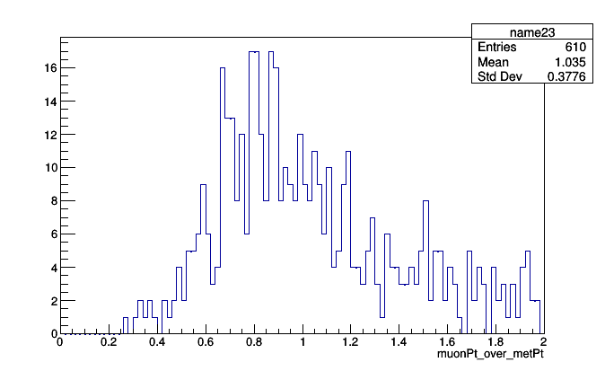

So we can assign axis labels programmatically. The fact that this function is named `muonPt_over_metPt` is declared right above its definition, right after the "`def`." If we change the content of the function (such as a unit conversion for some quantity with units), the new behavior is close to the name, and hopefully we'd notice the error if the label is no longer appropriate.

Given that we're using the name of the function as an axis label, what if we want special symbols in the name? We can override the Python name like this:

```python
muonPt_over_metPt = named(muonPt_over_metPt, "muon p_{T} / MET p_{T}")
```

This `named` can be used for lambda functions as well.

It's also common for an analysis to show the same quantity plotted many different ways, looking for correlations between pairs of quantities. A non-lambda or named lambda function can be reused:

```python
def muonPt(muon): return muon.pt

muonAnalysis = UntypedLabel(
    pt_vs_eta = Bin(100, -2.4, 2.4, lambda muon: muon.eta, Deviate(muonPt)),
    pt_vs_phi = Bin(100, -math.pi, math.pi, lambda muon: muon.phi, Deviate(muonPt)),
    pt_positive = Select(lambda muon: muon.q > 0, Bin(100, -math.pi, math.pi, muonPt)),
    pt_negative = Select(lambda muon: muon.q < 0, Bin(100, -math.pi, math.pi, muonPt)))

for i, event in enumerate(events):
    if i == 1000: break
    for muon in event.muons:
        muonAnalysis.fill(muon)
```

Now if you set all axis labels with `quantity.name` and change the name and definition of `muonPt` once, it gets updated in all four plots with no extra work. For instance,

```python
muonPt = named(lambda muon: muon.pt / 1000.0, "muon p_{T} [TeV]")
```

changes all uses of `muonPt` to TeV and gets every axis label right. The difference between these labels and ROOT's names and titles is that Histogrammar assigns a name to each _quantity_ to be plotted, whereas ROOT assigns a name to each _plot._ The fact that many plots can share the same quantity makes this fine-grained labeling useful.

### Caching functions

If you've concerned that replacing expressions like `muon.pt` with functions like `lambda muon: muon.pt` everywhere would make the analysis slow, note that you can cache functions. If a function is expensive and used in many plots, wrap it in `cached`:

```python
muonPt = cached(named(lambda muon: muon.pt / 1000.0, "muon p_{T} [TeV]"))
```

Calling this function several times in a row with the same inputs will cause it to return the last computed value, rather than recomputing the value.

### Strings as functions

Uniquely to the Python version of Histogrammer, a simple string could be used in place of a function. That is, all examples in this entire tutorial could be simplified by replacing

```python
histogram = Bin(100, 0, 100, lambda event: event.met.pt)
```

with

```python
histogram = Bin(100, 0, 100, "met.pt")
```

and

```python
histogram =
    Select(lambda muon: muon.iso > 3,
        Bin(100, 0, 100, lambda muon: math.sqrt(muon.px**2 + muon.py**2)))
```

with

```python
histogram = Select("iso > 3", Bin(100, 0, 100, "sqrt(px**2 + py**2)"))
```

That is, you can use strings reminiscent of `TTree.Draw`. These strings are interpreted as Python expressions with all imported modules, the `math` library, and the fields of the `event` or `muon` object imported. Python knows what `met` is because the input `events` have `met` as a field. Python knows what `px` and `py` are in the context of a stream of `muons`, and it knows about `sqrt` because that's in the `math` library.

Other back-ends might interpret these strings differently: for instance as Numpy operations or CUDA/OpenCL code. However, basic operations like `+`, `-`, `*`, and `/` would always work.

Unless overriden by `named`, the name of a string-based function is equal to the expression itself. In the above example, a ROOT histogram would be labeled with `"iso > 3"` and `"sqrt(px**2 + py**2)"`.

## Interoperability and distributed systems

At the end of this tutorial on using Histogrammar in Python with PyROOT, we'll see how to send histograms to other systems running Histogrammar or pull histograms in from such systems.

Every Histogrammar primitive has a JSON representation, and these representations are identical in all languages and systems Histogrammar is implemented on. Sending a bundle of histograms across the network is as transparent as sending JSON text.

```python
bundle = Label( \
  MET = Label(
    px = Bin(10, 0, 100, lambda event: event.met.px),
    py = Bin(10, 0, 100, lambda event: event.met.py)),
  primary = Label(
    num = Bin(10, 0, 100, lambda event: event.numPrimaryVertices)))

for i, event in enumerate(events):
    if i == 1000: break
    bundle.fill(event)

import json
serialized = json.dumps(bundle.toJson())
print(serialized)
```

produces

```json
{
  "type": "Label",
  "data": {
    "entries": 1000,
    "type": "Label",
    "data": {
      "MET": {
        "entries": 1000,
        "type": "Bin",
        "data": {
          "px": {
            "low": 0,
            "high": 100,
            "entries": 1000,
            "values:type": "Count",
            "values": [221, 172, 71, 41, 16, 12, 2, 0, 1, 0],
            "underflow:type": "Count", "underflow": 464,
            "overflow:type": "Count", "overflow": 0,
            "nanflow:type": "Count", "nanflow": 0},
          "py": {
            "low": 0,
            "high": 100,
            "entries": 1000,
            "values:type": "Count",
            "values": [198, 120, 65, 46, 27, 3, 1, 2, 0, 0],
            "underflow:type": "Count", "underflow": 538,
            "overflow:type": "Count", "overflow": 0,
            "nanflow:type": "Count", "nanflow": 0}
        }
      },
      "primary": {
        "entries": 1000,
        "type": "Bin",
        "data": {
          "num": {
            "low": 0,
            "high": 100,
            "entries": 1000,
            "values:type": "Count",
            "values": [916, 84, 0, 0, 0, 0, 0, 0, 0, 0],
            "underflow:type": "Count", "underflow": 0,
            "overflow:type": "Count", "overflow": 0,
            "nanflow:type": "Count", "nanflow": 0}
        }
      }
    }
  }
}
```

on any system. If any names were used, they'd appear here so that they can be carried on. Only the functions themselves, the Python bytecode, is dropped. A Scala/R/Javascript implementation of Histogrammar wouldn't know what to do with Python bytecode.

Similarly, we can create a tree of aggregators from JSON:

```python
bundle2 = Factory.fromJson(json.loads(serialized))

roothist = bundle2.get("MET").get("px").root("name24")
roothist.Draw()
```

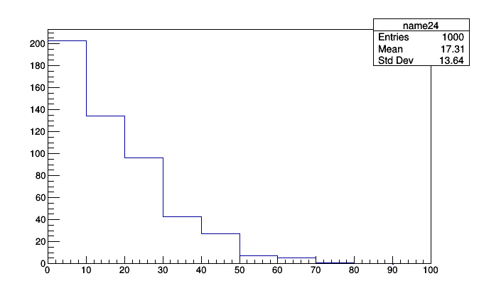

That histogram could have come from anywhere&mdash; a PDP-8 running COBOL&mdash; an iWatch tracking jogging speed&mdash; anywhere. All you need is a conduit that prints text, and you can plot it in ROOT.
